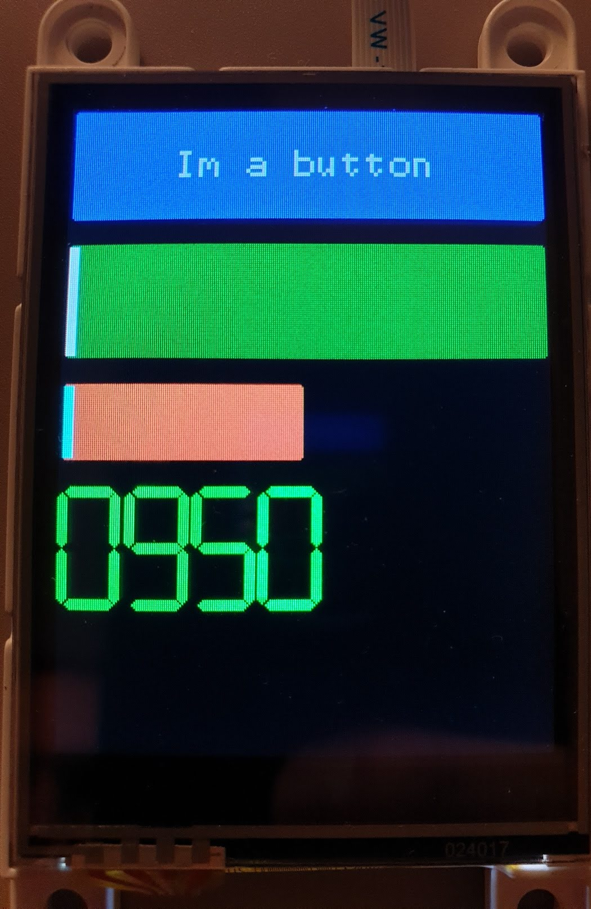

# GFX4dPrimitiveWidgets

## About

Widgets to use with 4dSystems gen4-Iod displays. Touch detection is not part of this library, but can be passed to change visuals and trigger callback.
Up to this moment this library has three components:
* Button
* Slider
* Seven segment display (numeric only)

